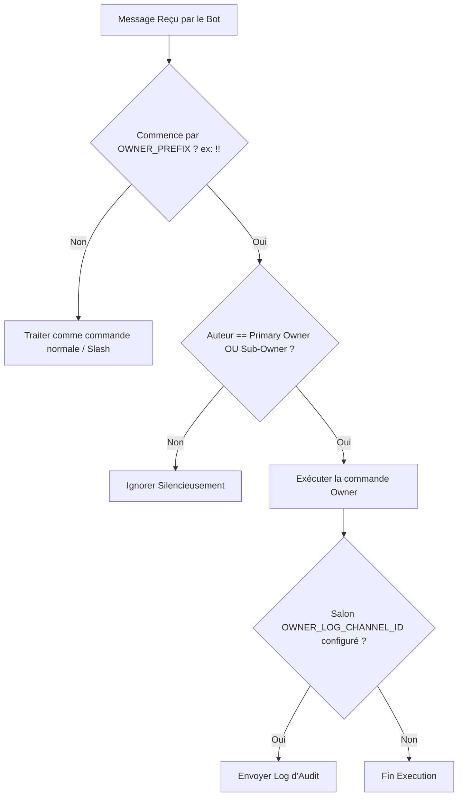

# 👑 Document de Référence — Commandes Owner (William / Flowie)

Ce document répertorie l'ensemble des **commandes réservées au Propriétaire du Bot (Bot Owner)** et aux **Propriétaires de Serveur (Server Owners)** du projet **William (Flowie)**.

---

## 🔒 1. Système de Commandes Bot Owner (`!!`)

Les commandes de gestion du bot sont exécutées via des messages textuels préfixés (par défaut `!!`). 

> [!IMPORTANT]
> **Sécurité & Discrétion :**
> - **Vérification silencieuse :** Si l'utilisateur n'est ni le `primaryOwnerId` ni présent dans `subOwnerIds`, le bot **ignore totalement le message** sans envoyer de message d'erreur ou d'indice quant à l'existence de la commande.
> - **Audit Logging :** Si la variable `OWNER_LOG_CHANNEL_ID` est configurée, chaque exécution de commande owner est journalisée dans le salon Discord correspondant.

### 🔑 Configuration d'Accès Owner

Les identifiants et préfixes se configurent dans le fichier `.env` ou `config.json` :

| Variable d'environnement | Fichier `config.json` | Description | Valeur par défaut |
| :--- | :--- | :--- | :--- |
| `OWNER_ID` | `owners.primaryOwnerId` | ID Discord du propriétaire principal du bot | `""` |
| `OWNER_PREFIX` | N/A | Préfixe utilisé pour déclencher les commandes owner | `!!` |
| `OWNER_LOG_CHANNEL_ID` | `owner.logChannelId` | ID du salon Discord pour les logs d'audit des commandes owner | `""` |
| N/A | `owners.subOwnerIds` | Tableau d'IDs Discord autorisés en sous-owners | `[]` |

---

## 🛠️ 2. Liste Complète des Commandes Bot Owner

Voici la référence exhaustive des **11 commandes propriétaires** intégrées dans [ownerHandler.ts](file:///e:/projets/flowie%20base/flowie/src/owner-commands/ownerHandler.ts) :

### 1. `!!eval <code>`
* **Description :** Exécute du code JavaScript/TypeScript arbitraire au sein du processus Node.js du bot.
* **Sécurité :** Détection automatique des mots-clés destructifs ou sensibles (`process.exit`, `rm`, `deleteMany`, `DISCORD_TOKEN`, `token`, `env`). En cas de mot-clé sensible, le bot requiert une confirmation par bouton. Les jetons Discord sont automatiquement masqués (`[REDACTED_TOKEN]`).
* **Exemple :** `!!eval message.client.guilds.cache.size`

---

### 2. `!!reload`
* **Description :** Recharge à chaud (hot reload) toutes les commandes Slash du bot sans nécessiter un redémarrage du processus.
* **Usage :** `!!reload`

---

### 3. `!!shardinfo`
* **Description :** Affiche les statistiques techniques en temps réel de la Shard actuelle (Heap Mémoire utilisée en MB, latence WebSocket, nombre de serveurs et membres gérés).
* **Usage :** `!!shardinfo`

---

### 4. `!!guilds [recherche]`
* **Description :** Liste les serveurs (guilds) sur lesquels le bot est actuellement présent. Permet de filtrer par nom ou par ID Discord.
* **Usage :** `!!guilds` ou `!!guilds Florynx`

---

### 5. `!!leaveguild <guildId>`
* **Description :** Force le bot à quitter immédiatement un serveur Discord spécifié par son ID.
* **Usage :** `!!leaveguild 123456789012345678`

---

### 6. `!!blacklist <add|remove|list> [targetId] [raison]`
* **Description :** Gère la liste noire globale (interdiction d'utiliser le bot pour un utilisateur ou un serveur entier).
* **Sous-commandes :**
  - `!!blacklist list` : Affiche tous les éléments bannis.
  - `!!blacklist add <targetId> [raison]` : Ajoute un utilisateur ou un serveur à la liste noire.
  - `!!blacklist remove <targetId>` : Retire un utilisateur/serveur de la liste noire.
* **Exemple :** `!!blacklist add 987654321098765432 Spam répétitif`

---

### 7. `!!premium <add|remove|check> <userId> [maxGuilds] [duree_jours]`
* **Description :** Gère les abonnements et les quotas Premium accordés aux utilisateurs.
* **Sous-commandes :**
  - `!!premium add <userId> [maxGuilds] [duree_jours]` : Octroie le statut Premium (ex: `maxGuilds = -1` pour illimité).
  - `!!premium remove <userId>` : Rétrograde l'utilisateur au plan Free (1 serveur max).
  - `!!premium check <userId>` : Affiche les détails du plan d'un utilisateur.
* **Exemple :** `!!premium add 1234567890 5 30` *(Accorde 5 serveurs pendant 30 jours)*

---

### 8. `!!broadcast <message>`
* **Description :** Diffuse un message d'annonce officielle dans le salon système ou de logs de **TOUS** les serveurs où le bot est installé.
* **Sécurité :** Requiert une confirmation préalable via un bouton interactif.
* **Exemple :** `!!broadcast Maintenance programmée ce soir à 23h00.`

---

### 9. `!!setstatus <texte>`
* **Description :** Modifie dynamiquement le texte de l'activité/statut du bot affiché sur Discord.
* **Exemple :** `!!setstatus /help • v2.0`

---

### 10. `!!stats-global`
* **Description :** Affiche une vue globale du système : nombre total de serveurs, nombre total de membres, temps d'activité (uptime), version de Node.js et version de `discord.js`.
* **Usage :** `!!stats-global`

---

### 11. `!!timecapsule force-open <capsuleId>` *(alias: `!!force-open <capsuleId>`)*
* **Description :** Permet l'ouverture d'urgence d'une capsule temporelle scellée, réservée exclusivement au Bot Owner.
* **Exemple :** `!!timecapsule force-open cap_123456`

---

## 👑 3. Commandes Privilégiées pour les Propriétaires / Administrateurs de Serveurs

En plus des commandes Bot Owner ci-dessus, voici les **commandes Slash privilégiées** réservées au **Propriétaire du Serveur Discord (Guild Owner)** ou aux membres disposant des permissions d'administration :

| Commande Slash | Module | Description | Permission Requise |
| :--- | :--- | :--- | :--- |
| `/setup` | Management | Assistant pas-à-pas interactif pour configurer entièrement le serveur | Administrateur / Owner du serveur |
| `/config` | Management | Configuration avancée (logs, rôle automatique, anti-spam, devises) | Administrateur |
| `/welcome` | Management | Configuration des messages et cartes de bienvenue/départ | Administrateur |
| `/autorole` | Management | Définition du rôle automatique attribué aux nouveaux membres | Administrateur |
| `/verify setup` | Verify | Configuration du système de vérification anti-bot / Captcha | Administrateur |
| `/counting setup` | Counting | Configuration du salon de jeu de comptage collaboratif | Administrateur |
| `/config-birthday` | Birthday | Configuration du salon des annonces d'anniversaires | Administrateur |
| `/config-confess` | Confess | Configuration du salon de réception des confessions anonymes | Administrateur |
| `/config-report` | Report | Configuration du salon de réception des signalements staff | Administrateur |
| `/invites-bonus` | Invites | Attribution ou retrait de points d'invitations bonus à un membre | Administrateur |
| `/invites-reset` | Invites | Réinitialisation complète des compteurs d'invitations du serveur | Administrateur |

---

## 📊 Récapitulatif Synthétique des Commandes Bot Owner

